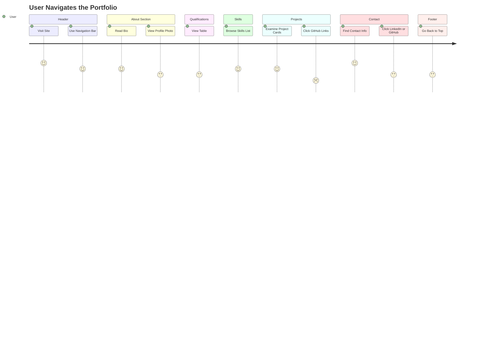

# Portfolio Website README

This README provides my detailed walkthrough of the `index.html` and `style.css` files for my personal portfolio website. The project showcases my skills, educational qualifications, projects, and contact information with a modern, responsive design.

---

## Overview

This portfolio site represents me, **Arush Garg**, an aspiring AI engineer. It introduces me, highlights my academic history, enumerates my technical skills, presents my personal projects, and provides my contact details in a single, visually appealing webpage.

---

# `index.html`

The `index.html` file is the main structure of my portfolio website. It uses semantic HTML5 elements to organize content into clear, accessible sections.

---

## HTML Structure

The page follows a classic one-page layout:

- **Header** (site title, description, navigation)
- **About**
- **Educational Qualifications**
- **Skills**
- **Projects**
- **Contact**
- **Footer**

---

### Header

The header introduces me and provides navigation links for easy section jumps.

```html
<!-- Header with title, subtitle, and navigation menu linking to all main sections -->
```

**Features:**
- Clear site title and tagline.
- Navigation menu for fast section access.
- Consistent styling using CSS classes.

---

### About Section

This section contains my profile image and an introductory paragraph about me.

```html
<!-- About section with profile image on one side and descriptive text on the other -->
```

- Uses flexbox (via CSS) to align the image and text side by side.
- Text highlights my experience and interests.

---

### Educational Qualifications

This section displays my education details in a table.

```html
<!-- Education section containing a table of institutes, boards, scores, and passing years -->
```

- Table format ensures easy comparison.
- Data includes school, board, scores, and years.

---

### Skills Section

This section lists my technical proficiencies.

```html
<!-- Skills section using an unordered list to show my main technologies and tools -->
```

- Uses a styled unordered list for clarity.
- Covers both programming languages and tools.

---

### Projects Section

This section showcases my projects, each in a styled card format.

```html
<!-- Projects section with multiple project cards, each having a title, description, and GitHub link -->
```

**Features:**
- Each project is enclosed in a `.project` div for individual styling.
- Includes repository links for open source viewing.

---

### Contact Section

This section lists my contact details with direct links.

```html
<!-- Contact section with email, phone, LinkedIn profile link, and GitHub profile link -->
```

- Makes it easy for visitors to reach out.
- Links to professional profiles are included.

---

### Footer

A simple footer closes the page.

```html
<!-- Footer with a short rights-reserved message -->
```

- Provides copyright.
- Ensures site feels complete.

---

### Navigation Flow

Users can jump to any section using the top navigation links, or return to the top with the "Back to Top" link at the bottom.

```html
<!-- Simple link that scrolls back to the top of the page -->
```

---

## Key HTML Practices

- Uses **semantic elements** like `<header>`, `<section>`, and `<footer>`.
- **Class-based CSS** for modular styling.
- **Responsive and user-friendly**, suitable for a modern web portfolio.

---

# `style.css`

The `style.css` file defines the visual presentation and layout of my portfolio. It uses modern CSS features for a clean, professional appearance.

---

## Global Styles

```css
/* Global reset plus dark theme background and base font configuration */
```

- **Reset styles:** Removes default browser spacing and sets box sizing for easier layout control.
- **Dark theme:** Uses black backgrounds and white text for a modern look.

---

## Header and Navigation

```css
/* Header layout, subtitle styling, navigation bar spacing, and link appearance with hover effects */
```

- **Flexbox** aligns navigation links horizontally.
- **Hover states** improve interactivity.
- **Consistent spacing** and boldness for clarity.

---

## Section and Heading Styles

```css
/* Generic section padding and h2 styling with bottom borders and spacing */
```

- Adds readable spacing.
- Headings have visual separation.

---

## Tables (Education)

```css
/* Education table sizing, row alignment, and highlight color for special links or text */
```

- **Full-width tables** for easy reading.
- **Custom color** for highlighted elements.

---

## About Section Layout

```css
/* Flex layout for the about section, image sizing, and paragraph width and font size */
```

- **Flexbox** arranges the photo and description side by side.
- Sets a fixed image width and readable paragraph width.

---

## Skills List

```css
/* Unstyled list with custom background, padding, margin, and left border for each skill item */
```

- **Custom backgrounds** and borders for skill items.
- **No bullet points**, just clean blocks.

---

## Projects

```css
/* Project cards with dark backgrounds, padding, borders, and heading spacing */
```

- Projects are visually separated in card-like containers.
- Headings stand out for each project.

---

## Contact and Footer

```css
/* Contact section spacing, paragraph margins, footer background, and back-to-top bar styling */
```

- **Spacing** improves legibility.
- Footer is visually distinct.

---

## User Journey Flow

Below is a user journey diagram showing how visitors can navigate the site.



---

## Key CSS Classes Table

| Class/Selector    | Purpose                                  |
|-------------------|------------------------------------------|
| `header`          | Styles the main header                   |
| `.p1`             | Styles the subtitle under header         |
| `#navlist`        | Aligns navigation menu horizontally      |
| `.navlinks`       | Individual navigation links              |
| `section`         | Adds spacing to sections                 |
| `.about`          | Flexbox for about section layout         |
| `.about-photo`    | Contains profile image                   |
| `.about-text`     | Contains the about paragraph             |
| `.edtable`        | Styles education table                   |
| `.skills-list`    | Styles the skills list                   |
| `.project`        | Styles each project card                 |
| `.gr`             | Highlights GitHub links                  |
| `.contact-info`   | Styles contact details                   |
| `.fback`          | Styles "Back to Top" link                |
| `footer`          | Styles page footer                       |

---

# Best Practices & Recommendations

```card
{
  "title": "Accessibility and Usability",
  "content": "I use semantic HTML and clear contrast for readability. I also test navigation links and image alt attributes."
}
```

```card
{
  "title": "Customization Tips",
  "content": "I can easily update section content and add more projects by duplicating the project card markup."
}
```

---

# Conclusion

This portfolio template is a clean, effective way to showcase my skills and experience. The combination of semantic HTML and modular CSS makes it easy for me to customize and extend. The navigation, layout, and design choices ensure the site is both visually appealing and user-friendly.
