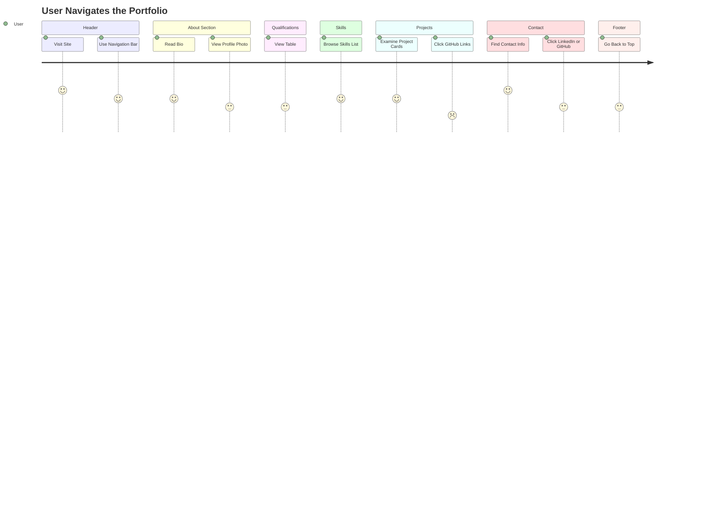

# Portfolio Website README

This documentation provides a detailed walkthrough of the `index.html` and `style.css` files for a personal portfolio website. The project showcases a student's skills, educational qualifications, projects, and contact information with a modern, responsive design.

---

## Overview

This portfolio site is designed for **Arush Garg**, an aspiring AI engineer. It introduces Arush, highlights academic history, enumerates technical skills, presents personal projects, and provides contact details—all in a single, visually appealing webpage.

---

# `index.html`

The `index.html` file is the main structure of the portfolio website. It uses semantic HTML5 elements to organize content into clear, accessible sections.

---

## HTML Structure

The page follows a classic one-page layout:

- **Header** (site title, description, navigation)
- **About**
- **Educational Qualifications**
- **Skills**
- **Projects**
- **Contact**
- **Footer**

---

### Header

The header introduces the portfolio owner and provides navigation links for easy section jumps.

```html
<header>
  <h1 id="strt">Arush Garg | Aspiring AI Engineer </h1>
  <p class="p1">1st Year B.Tech CSE (AIML) Student at KIET Group of Institutions </p>
  <nav>
    <ul id="navlist">
      <li><a class="navlinks" href="#about">About Me</a></li>
      <li><a class="navlinks" href="#edu">Educational Qualifications</a></li>
      <li><a class="navlinks" href="#skills">Skills</a></li>
      <li><a class="navlinks" href="#projects">Projects</a></li>
      <li><a class="navlinks" href="#contact">Contact</a></li>
    </ul>
    <hr>
  </nav>
</header>
```

**Features:**
- Clear site title and tagline.
- Navigation menu for fast section access.
- Consistent styling using CSS classes.

---

### About Section

This section contains a profile image and an introductory paragraph.

```html
<section id="about">
  <h2>About Me</h2>
  <div class="about">
    <div class="about-photo">
      
    </div>
    <div class="about-text">
      <p>
        <strong> Hello!! </strong>I am a first-year student at KIET Group of Institutions doing my BTech in CSE(AIML). I am passionate about web development and creating dynamic websites and applications. Driven by curiosity and a love for coding, I enjoy learning new technologies and solving challenges through programming. With experience in HTML, CSS, Node.js, C, and Python, I am continuously honing my skills to build innovative and effective digital projects.
      </p>
    </div>
  </div>
</section>
```

- Uses flexbox (via CSS) to align the image and text side by side.
- Text highlights experience and interests.

---

### Educational Qualifications

Displays education details in a table.

```html
<section id="edu" class="edu">
  <h2>Educational Qualifications</h2>
  <table class="edtable" cellpadding="10" cellspacing="0" border="1">
    <tr>
      <th><em>School/College Name</em></th>
      <th><em>Board/University</em></th>
      <th><em>Score</em></th>
      <th><em>Year of Passing</em></th>
    </tr>
    <tr>
      <td>DDPS</td>
      <td>CBSE</td>
      <td>89.8%</td>
      <td>2023</td>
    </tr>
    <tr>
      <td>DDPS</td>
      <td>CBSE</td>
      <td>93.8%</td>
      <td>2025</td>
    </tr>
    <tr>
      <td>KIET</td>
      <td>AKTU</td>
      <td>__ CGPA</td>
      <td>2029</td>
    </tr>
  </table>
</section>
```

- Table format ensures easy comparison.
- Data includes school, board, scores, and years.

---

### Skills Section

Lists technical proficiencies.

```html
<section id="skills">
  <h2>Skills</h2>
  <ul class="skills-list">
    <li>HTML & CSS</li>
    <li>C</li>
    <li>Python</li>
    <li>Express.js / Node.js</li>
    <li>Git & GitHub</li>
  </ul>
</section>
```

- Uses a styled unordered list for clarity.
- Covers both programming languages and tools.

---

### Projects Section

Showcases the user's projects, each in a styled card format.

```html
<section id="projects" class="projects">
  <h2>Projects</h2>
  <div class="project">
    <h3>Project One</h3>
    <p>A responsive travel website built with HTML, CSS. Features include destinations gallery, list of places to visit. <br> <br> GitHub Repository:-<a href="https://github.com/Arush07-afk/Explore-The-World-202501100400086" class="gr"> Explore The World</a> </p>
  </div>
  <div class="project">
    <h3>Project Two</h3>
    <p>A responsive art gallery website built with HTML, CSS. Features include many popular art and some key information about them. <br> <br> GitHub Repository:- <a href="https://github.com/Arush07-afk/Vivid-Visions" class="gr">Vivid Visions</a> </p>
  </div>
  <div class="project">
    <h3>Project Three</h3>
    <p>Portfolio website with clean design and with smooth navigation.</p>
  </div>
</section>
```

**Features:**
- Each project is enclosed in a `.project` div for individual styling.
- Includes repository links for open source viewing.

---

### Contact Section

Lists contact details with direct links.

```html
<section id="contact">
  <h2>Contact</h2>
  <div class="contact-info">
    <p><strong>Email:</strong> gargarush07@gmail.com</p>
    <p><strong>Phone:</strong> 7011116500</p>
    <p><strong>LinkedIn:</strong><a id="contlinks" href="linkedin.com/in/arush-garg-012860380/"> Arush Garg</a></p>
    <p><strong>GitHub:</strong><a id="contlinks" href="github.com/Arush07-afk"> Arush07-afk</a></p>
  </div>
</section>
```

- Makes it easy for visitors to reach out.
- Links to professional profiles are included.

---

### Footer

A simple footer closes the page.

```html
<footer>
  <p> &copy All Rights Reserved</p>
</footer>
```

- Provides copyright.
- Ensures site feels complete.

---

### Navigation Flow

Users can jump to any section using the top navigation links, or return to the top with the "Back to Top" link at the bottom.

```html
<div class="fback"><a href="#strt">Back to Top</a></div>
```

---

## Key HTML Practices

- Uses **semantic elements** like `<header>`, `<section>`, and `<footer>`.
- **Class-based CSS** for modular styling.
- **Responsive and user-friendly**, suitable for a modern web portfolio.

---

# `style.css`

The `style.css` file defines the visual presentation and layout of the portfolio. It uses modern CSS features for a clean, professional appearance.

---

## Global Styles

```css
* { margin: 0; padding: 0; box-sizing: border-box; align-items: center; }
body { font-family: Arial, sans-serif; background-color: #000000; color:white; }
```

- **Reset styles:** Removes default browser spacing and sets box sizing for easier layout control.
- **Dark theme:** Uses black backgrounds and white text for a modern look.

---

## Header and Navigation

```css
header { background: black; color: white; padding: 1rem; text-align: center; }
.p1 { font-size: 1.2rem; margin-top: 8px; padding-bottom:9px ; border-bottom: 3px solid white; }
nav { margin-top: 1rem; margin-bottom: 1rem; }
hr{ width: 60%; margin:auto; height: 3px ; background: white; }
#navlist { list-style: none; display: flex; justify-content: center; padding-bottom: 10px; font-weight: bold; }
a { color: white; text-decoration: none; }
a:hover { text-decoration: underline; }
.navlinks { color: white; text-decoration: none; margin: 0 20px ; }
```

- **Flexbox** aligns navigation links horizontally.
- **Hover states** improve interactivity.
- **Consistent spacing** and boldness for clarity.

---

## Section and Heading Styles

```css
section { padding: 40px 20px; width: auto; margin: 0 auto; }
h2 { color: white; margin-bottom: 20px; border-bottom: 3px solid white; padding-bottom: 10px; }
```

- Adds readable spacing.
- Headings have visual separation.

---

## Tables (Education)

```css
.edtable { width: 100% ; height:200px ; }
.gr{ color: rgb(238, 100, 100); }
tr{ text-align: center; }
```

- **Full-width tables** for easy reading.
- **Custom color** for highlighted elements.

---

## About Section Layout

```css
.about-photo img { width: 200px; }
.about{ display:flex; justify-content: space-evenly; text-align: center; }
.about-text p{ width: 600px; margin-left: 20px; font-size: 23px; }
```

- **Flexbox** arranges the photo and description side by side.
- Sets a fixed image width and readable paragraph width.

---

## Skills List

```css
ul { list-style: none; }
.skills-list li { background: #141706; padding: 10px; margin: 10px 0; border-left: 4px solid white; }
```

- **Custom backgrounds** and borders for skill items.
- **No bullet points**, just clean blocks.

---

## Projects

```css
.projects { background: #000000; }
.project { background: black; padding: 20px; margin: 20px 0; border: 1px solid #ffffff; }
.project h3 { color: white; margin-bottom: 10px; }
```

- Projects are visually separated in card-like containers.
- Headings stand out for each project.

---

## Contact and Footer

```css
.contact-info { margin-top: 20px; }
.contact-info p { margin: 10px 0; }
footer { background: black; color: white; text-align: center; padding: 20px; }
.fback { text-align: center ; background: #333; padding: 10px; }
```

- **Spacing** improves legibility.
- Footer is visually distinct.

---

## User Journey Flow

Below is a user journey diagram showing how visitors can navigate the site.



---

## Key CSS Classes Table

| Class/Selector    | Purpose                                  |
|-------------------|------------------------------------------|
| `header`          | Styles the main header                   |
| `.p1`             | Styles the subtitle under header         |
| `#navlist`        | Aligns navigation menu horizontally      |
| `.navlinks`       | Individual navigation links              |
| `section`         | Adds spacing to sections                 |
| `.about`          | Flexbox for about section layout         |
| `.about-photo`    | Contains profile image                   |
| `.about-text`     | Contains the about paragraph             |
| `.edtable`        | Styles education table                   |
| `.skills-list`    | Styles the skills list                   |
| `.project`        | Styles each project card                 |
| `.gr`             | Highlights GitHub links                  |
| `.contact-info`   | Styles contact details                   |
| `.fback`          | Styles "Back to Top" link                |
| `footer`          | Styles page footer                       |

---

# Best Practices & Recommendations

```card
{
  "title": "Accessibility and Usability",
  "content": "Use semantic HTML and clear contrast for readability. Test navigation links and image alt attributes for accessibility."
}
```

```card
{
  "title": "Customization Tips",
  "content": "Easily update section content and add more projects by duplicating the project card markup."
}
```

---

# Conclusion

This portfolio template is a clean, effective way to showcase a student's skills and experience. The combination of semantic HTML and modular CSS makes it easy to customize and extend. The navigation, layout, and design choices ensure the site is both visually appealing and user-friendly.
